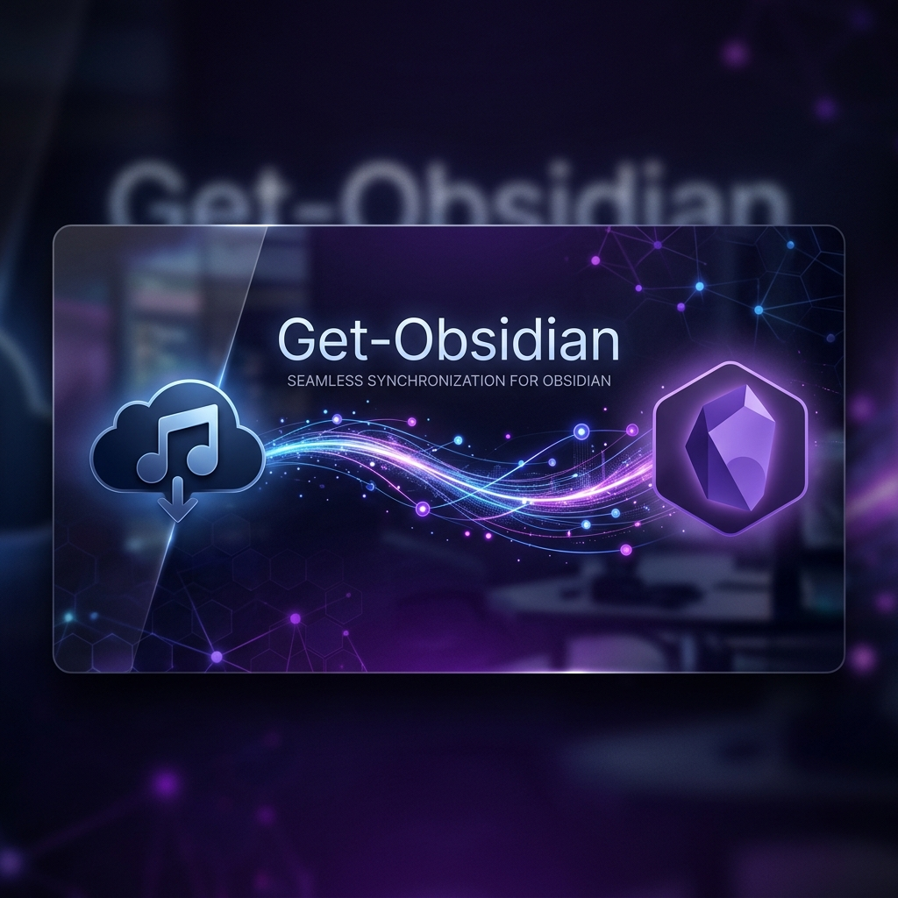

<p align="center">
  
</p>

<p align="center">
  <a href="https://github.com/Jiashu329/obsidian-getbiji/releases">
    
  </a>
  
  
  
</p>

<h1 align="center">Getbiji for Obsidian</h1>

<p align="center">
  这是一款 <a href="https://obsidian.md/">Obsidian</a> 插件，通过 <a href="https://www.biji.com/openapi">Get 笔记开放平台 API</a> 将云端内容无缝同步到本地库，生成结构化的标准 Markdown 笔记。
</p>

---

## 🏗️ 核心功能

- 🚀 **智能同步引擎**：支持**全量覆盖**或**增量更新**，支持按「最近3天/1周/1月」快速筛选。
- 📦 **知识库同步 (新!)**：支持按**指定知识库**单独同步，自动在同步目录下按知识库名称创建子文件夹。
- 🔍 **精准匹配**：基于 `get_note_id` 匹配，即使修改文件名或移动路径也能精准更新，杜绝重复。
- 🔗 **内链转换**：自动将 Get 站内链接转换为 Obsidian 标准**双链** `[[标题]]`。
- 🏷️ **属性管理**：完美支持 Obsidian YAML Frontmatter，涵盖标签、URL、创建/更新时间及附件元数据。
- 📱 **全平台适配**：适配桌面端与移动端，随时随地管理笔记。

## 📸 效果展示

同步完成后，插件会根据云端内容自动补全 YAML 属性、正文、附件链接以及音频、网页摘录等模块。

> **同步报告**：每次同步完成后会生成一份详细的「同步报告.md」，记录写入与跳过的详细清单。

## 🛠️ 如何使用

### 1. 获取凭证
前往 [Get 笔记开放平台](https://www.biji.com/openapi) 创建应用并获取你的 **Client ID** 和 **API key**。

### 2. 插件配置
- 进入 Obsidian **设置 → Getbiji**。
- 输入凭证，并选择你的同步存放目录。

### 3. 开始同步
- **全局同步**：点击左侧 Ribbon 栏的云图标，或通过命令面板 `Cmd/Ctrl + P` 运行 `同步 get 笔记`。
- **知识库同步**：通过命令面板运行 `同步指定知识库`，在弹窗中选择目标知识库并确认同步策略。

## ⚙️ 设置选项

| 设置项 | 说明 |
| :--- | :--- |
| **Client ID** | 开放平台应用标识 |
| **API key** | 开放平台密钥 |
| **同步目录** | 笔记写入的相对路径，如 `Getbiji` |
| **请求间隔** | 每条笔记同步后的暂停时间（防止被限流） |

## 📥 安装方式

### 方法 A：社区插件（推荐）
在 Obsidian **设置 → 第三方插件 → 浏览** 中搜索 `Getbiji` 进行安装。

### 方法 B：手动安装
1. 从 [Releases](https://github.com/Jiashu329/obsidian-getbiji/releases) 下载最新版的 `main.js`, `manifest.json`, `styles.css`。
2. 将文件放入库目录 `.obsidian/plugins/getbiji/` 下。
3. 在设置中开启插件。

## 🧑‍💻 开发者相关

```bash
# 安装依赖
npm install
# 开发模式
npm run dev
# 构建发布
npm run build
```

## 📄 许可证

本项目基于 [GPL-3.0](./LICENSE) 协议开源。

---

<p align="center">
  如果这个插件对你有帮助，欢迎点个 <b>Star</b> ⭐<br>
  如有疑问或建议，请提交 <a href="https://github.com/Jiashu329/obsidian-getbiji/issues">Issues</a>
</p>
