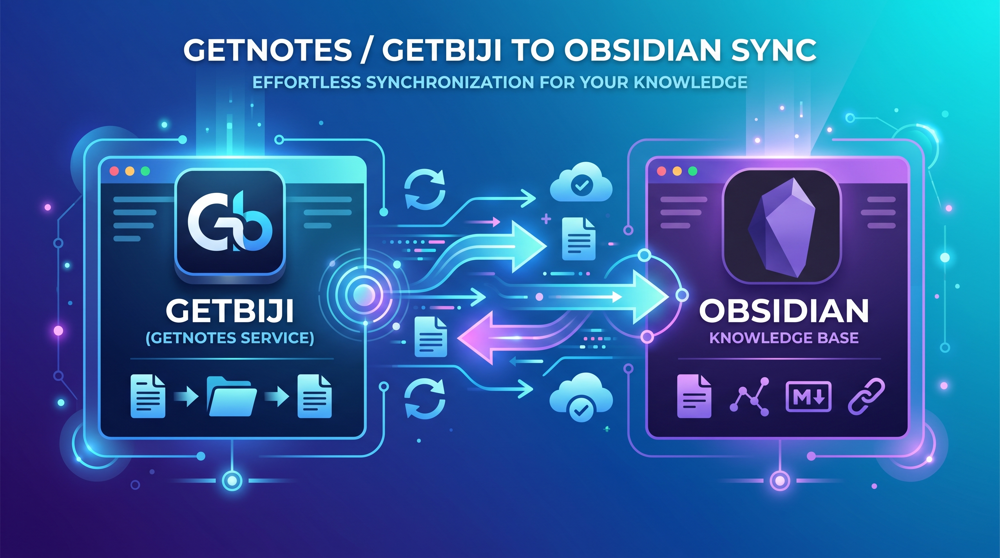

  

  
  
  
  

<h1 align="center">Getbiji for Obsidian</h1>

> **让碎片化阅读优雅地沉淀到你的 Obsidian 笔记仓库中。**

[Getbiji](https://www.biji.com) 官方同步插件，专注于将你在 Get 移动端、网页版及各类浏览器插件中剪裁的笔记，无缝、高效地同步至本地 Obsidian 库。

---

## ✨ 核心特性

### 🚀 三大同步维度

- **我的笔记**：个人剪裁、整理的所有私密笔记。
- **知识库同步**：支持同步你创建或参与的所有 Getbiji 知识库专题。
- **订阅博主**：追踪你关注的创作者（抖音、微信、得到等），将他们的深度内容一键抓取至本地。

### 🤖 AI 智能加持

- **自动 AI 摘要**：博主内容同步时，插件会自动提取 AI 生成的内容摘要，并以 `[!abstract]` 的精美 Callout 形式展示在笔记顶部。

### 🎨 极致 UI 体验

- **统一同步窗口**：不再纠结增量或全量，一个窗口内搞定日期筛选与同步模式。
- **平台图标识别**：完美适配 **抖音**、**微信**、**得到**等平台，博主列表自带品牌 Logo。
- **智能截断**：长标题自动优化，确保文件名合规且整洁。

### 详细报告

- **自动生成报告**：每次同步完成后，插件都会在根目录生成 `同步报告.md`，记录写入条数、成功标题及模式。

---

## 🛠️ 快速上手

### 1. 获取 API 凭证

1. 访问 [Getbiji 开放平台](https://openapi.biji.com)（或 Getbiji 官网设置页）。
2. 获取你的 `Client ID` 和 `API Key`。

### 2. 插件安装与配置

1. 在 Obsidian **设置 → 第三方插件** 中搜索 `Getbiji` 安装（或手动安装）。
2. 在 **Getbiji 设置** 面板中输入上述凭证。
3. 设定你的 **同步存放目录**（默认为 `GetBiji`）。

---

## 📖 使用指南

### 统一触发入口

你可以通过左侧的 **云朵图标**，或通过命令面板 (`Cmd/Ctrl + P`) 搜索以下命令：

- **同步我的笔记**：最常用的全量/增量同步入口。
- **同步指定知识库**：选择特定专题进行定向同步。
- **同步订阅博主**：聚合展示你关注的博主，选择后开始同步。

### 整理后的文件夹层级

插件会自动为你整理目录，让库结构井井有条：

- `Getbiji/我的笔记/` - 存放个人散点笔记。
- `Getbiji/知识库/{知识库名称}/` - 按专题分类存放。
- `Getbiji/订阅博主/{博主名称}/` - 追踪创作者动态。

---

## 🛡️ 安全与隐私

- **纯本地处理**：所有笔记直接写入你的本地仓库，不通过任何第三方转发。
- **按需请求**：插件仅在同步时与 Getbiji 官方 API 通信，无任何后台静默行为。

---

## 🤝 反馈与建议

如果你在使用过程中有任何问题，欢迎在 GitHub 提交 [Issue](https://github.com/Jiashu329/obsidian-getbiji/issues) 或者是加入我们的用户群。

---

*Made with ❤️ for the Getbiji community.*

## 📄 许可证

  如果这个插件对你有帮助，欢迎点个 <b>Star</b> ⭐ 
  如有疑问或建议，请提交 <a href="https://github.com/Jiashu329/obsidian-getbiji/issues">Issues</a>

